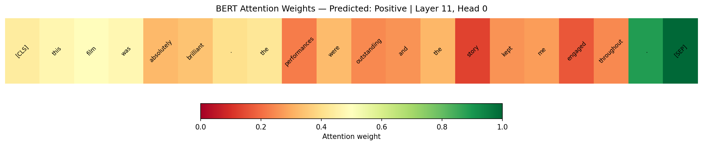
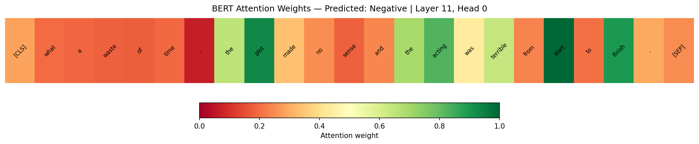

# IMDb Sentiment Analysis — BERT Fine-Tuning

This project fine-tunes **bert-base-uncased** on the IMDb movie reviews dataset for binary sentiment classification. It serves as a direct comparison to the classical [TF-IDF + Logistic Regression approach](../imdb-sentiment-analysis/), demonstrating how transformer-based transfer learning improves on a strong classical NLP baseline.

---

## 📌 Problem Statement

Given a movie review written in natural language, predict whether the sentiment is **positive** or **negative**.

Same task as the classical IMDb project — fundamentally different paradigm.

- **Dataset:** 50,000 IMDb movie reviews (25,000 train / 25,000 test)
- **Balance:** Perfectly balanced — 50% positive, 50% negative
- **Model:** bert-base-uncased fine-tuned for sequence classification

---

## 🧠 Key Concepts Demonstrated

- Transfer learning with a pretrained transformer (BERT)
- WordPiece subword tokenization vs bag-of-words
- Fine-tuning with AdamW optimizer and linear learning rate warmup
- Gradient clipping for stable transformer training
- Attention weight visualization — what BERT focuses on per token
- Direct model comparison against a classical TF-IDF baseline

---

## 🔧 Pipeline Overview

```
Raw IMDb Reviews (25,000 train / 25,000 test)
        ↓
WordPiece Tokenization (max 256 tokens)
[CLS] review tokens [SEP] → input_ids + attention_mask
        ↓
bert-base-uncased (pretrained, 110M parameters)
12 transformer layers × 12 attention heads
        ↓
[CLS] token representation (768-dim)
        ↓
Linear Classification Head (768 → 2)
        ↓
Fine-Tuning: 3 epochs, AdamW lr=2e-5, linear warmup
        ↓
Evaluation (Accuracy, F1, AUC-ROC)
        ↓
Attention Visualization
```

---

## 🤖 Why BERT Outperforms TF-IDF

| Limitation of TF-IDF | How BERT addresses it |
|---------------------|----------------------|
| "not good" treated as two independent tokens | Bidirectional attention captures negation in context |
| Word meaning is fixed regardless of context | Contextual embeddings change per sentence |
| Vocabulary limited to training corpus | WordPiece handles unseen words via subword units |
| No world knowledge | Pretrained on 3.3B words of general text |

---

## ⚙️ Training Configuration

| Parameter | Value | Rationale |
|-----------|-------|-----------|
| `model` | bert-base-uncased | 12 layers, 110M params — strong balance of speed and accuracy |
| `max_length` | 256 | Covers most reviews; full 512 doubles memory with minimal gain |
| `batch_size` | 16 | Safe for T4 GPU at max_length=256 |
| `epochs` | 3 | Standard for BERT fine-tuning; more risks overfitting |
| `learning_rate` | 2e-5 | Lower end of recommended range (2e-5 to 5e-5) for stability |
| `warmup_ratio` | 0.1 | 10% of steps used for LR warmup — stabilizes early training |
| `weight_decay` | 0.01 | L2 regularization applied correctly via AdamW |
| `grad_clip` | 1.0 | Prevents exploding gradients through 12 layers of backprop |

---

## 📊 Results

| Metric | Score |
|--------|-------|
| Accuracy | **0.9215** |
| F1 Score | **0.9219** |
| AUC-ROC | **0.9752** |

### Classification Report

```text
              precision  recall  f1-score  support
    Negative       0.93    0.92      0.92    12500
    Positive       0.92    0.93      0.92    12500

    accuracy                          0.92    25000
   macro avg       0.92    0.92      0.92    25000
weighted avg       0.92    0.92      0.92    25000
```

### Confusion Matrix

```text
[[11457  1043]
 [  920 11580]]
```

---

## 🔬 Model Comparison

| Model | Accuracy | F1 | AUC-ROC |
|-------|----------|----|---------|
| TF-IDF + Logistic Regression | ~0.89 | ~0.89 | ~0.96 |
| **BERT (bert-base-uncased)** | **0.9215** | **0.9219** | **0.9752** |

BERT achieves **+3.2% accuracy** and **+3.2% F1** over the classical baseline by understanding words in context rather than as independent frequency counts.

### When to use each approach

| Consideration | TF-IDF + LR | BERT |
|--------------|-------------|------|
| Training time | ~10 seconds | ~30 minutes (GPU) |
| Inference speed | <1ms per review | ~50ms per review |
| Accuracy | ~89% | ~92% |
| Handles negation | Partially | Yes |
| Handles sarcasm | Poorly | Better |
| Production cost | Very low | Higher |

For high-volume production systems, TF-IDF may be the better engineering choice. BERT is worth the cost when accuracy is critical or text complexity demands contextual understanding.

---

## 👁️ Attention Visualization

BERT's attention mechanism shows which tokens the model focuses on when making a prediction. The heatmaps below show `[CLS]` token attention weights from the final transformer layer (layer 11).

**Positive review:**


**Negative review:**


Green = high attention weight · Red = low attention weight

---

## 🗂️ Dataset

- **Source:** [IMDb Large Movie Review Dataset](https://huggingface.co/datasets/imdb) via Hugging Face
- **Size:** 50,000 reviews (25,000 train / 25,000 test)
- **Balance:** 50% positive, 50% negative
- **Split:** 90% train / 10% validation carved from training set; test set held out until final evaluation

---

## 📂 Project Structure

```text
bert-sentiment-analysis/
│
├── bert_sentiment.py                      # Main fine-tuning and evaluation script
├── bert_sentiment_with_interview_notes.py # Annotated version with design rationale
├── attention_positive.png                 # Attention heatmap — positive review sample
├── attention_negative.png                 # Attention heatmap — negative review sample
├── requirements.txt                       # Project dependencies
└── README.md                              # Project documentation
```

---

## ⚙️ Installation

```bash
git clone https://github.com/Splodz/ai-ml-portfolio.git
cd ai-ml-portfolio/bert-sentiment-analysis
pip install -r requirements.txt
python bert_sentiment.py
```

> A CUDA-capable GPU is strongly recommended. Fine-tuning on CPU will take several hours.

---

## 📦 Requirements

```text
torch
transformers
datasets
scikit-learn
numpy
matplotlib
```

---

## 👤 Author

Graduate student in Artificial Intelligence with a focus on machine learning and deep learning systems.
