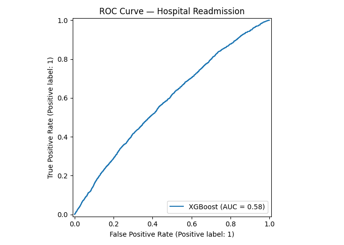
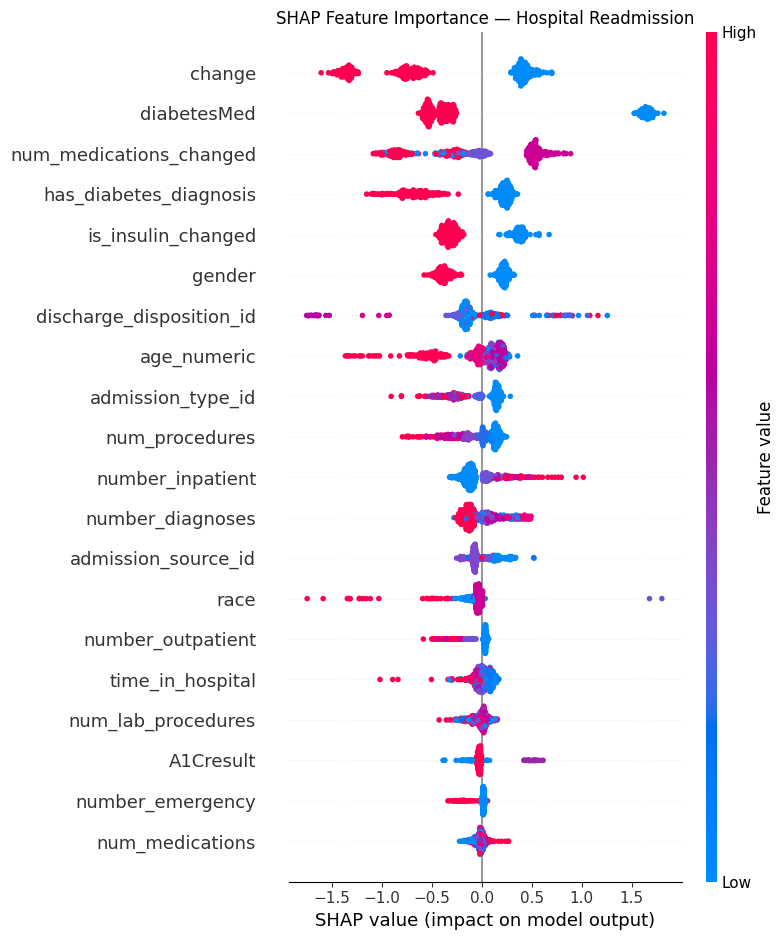

# Hospital Readmission Prediction (XGBoost + SHAP)

This project predicts whether a diabetic patient will be **readmitted to hospital within 30 days** using the UCI Diabetes 130-US Hospitals dataset. It demonstrates a complete machine learning pipeline on a real-world clinical dataset — including messy data cleaning, feature engineering from medical codes, class imbalance handling, and explainable AI with SHAP values.

---

## 📌 Problem Statement

Hospital readmissions within 30 days are a major quality indicator in healthcare and a significant cost driver. Predicting which patients are at risk enables earlier intervention and better resource allocation.

Given a patient's hospital encounter record — including demographics, diagnoses, medications, and lab results — predict whether they will be readmitted within 30 days.

- **Target:** Binary classification (readmitted within 30 days = 1, otherwise = 0)
- **Class imbalance:** Only ~11% of encounters result in early readmission

---

## 🧠 Key Concepts Demonstrated

- Real-world messy data cleaning (`?` missing values, high-missingness columns, inconsistent entries)
- Feature engineering from ICD-9 diagnosis codes and medication records
- Class imbalance handling with SMOTE (Synthetic Minority Oversampling Technique)
- XGBoost gradient boosting with tuned hyperparameters
- Clinically appropriate evaluation metrics (F1, AUC-ROC) — not just accuracy
- SHAP (SHapley Additive exPlanations) for global feature interpretability
- Data leakage prevention at every pipeline stage

---

## 🔧 Pipeline Overview

```
Raw Clinical Data (101,766 rows, 50 columns)
        ↓
Data Cleaning
(drop high-missingness cols, handle ? values, binarize target)
        ↓
Feature Engineering
(ICD-9 diagnosis flags, medication change counts, age encoding)
        ↓
Preprocessing + SMOTE
(label encoding, median imputation, oversample minority class)
        ↓
XGBoost Classifier
        ↓
Evaluation (F1, AUC-ROC, Confusion Matrix)
        ↓
SHAP Interpretability
```

---

## 🗂️ Dataset

- **Source:** [UCI Diabetes 130-US Hospitals Dataset](https://archive.ics.uci.edu/ml/datasets/Diabetes+130-US+hospitals+for+years+1999-2008)
- **Size:** 101,766 hospital encounters across 130 US hospitals (1999–2008)
- **Features:** 50 columns including demographics, diagnoses, medications, lab results
- **Target:** Readmission within 30 days (~11% positive class)
- **Key challenges:** Missing values encoded as `?`, near-zero variance columns, severe class imbalance, duplicate patient encounters

---

## 🧹 Data Cleaning

The raw dataset required substantial cleaning before modeling:

| Issue | Action |
|-------|--------|
| Missing values encoded as `?` | Replaced with `NaN` on load |
| `weight` (>96% missing) | Dropped |
| `payer_code` (>40% missing) | Dropped |
| `medical_specialty` (>49% missing) | Dropped |
| `examide`, `citoglipton` (near-zero variance) | Dropped |
| Administrative IDs (`encounter_id`, `patient_nbr`) | Dropped |
| Missing `race` rows | Dropped (~2% of data) |
| Target binarized | `<30` → 1, all else → 0 |

---

## ⚙️ Feature Engineering

New features were created from raw clinical columns to improve signal:

| Feature | Description |
|---------|-------------|
| `num_medications_changed` | Count of medications with dosage adjustments during encounter |
| `is_insulin_changed` | Binary flag for insulin dosage change (clinically significant) |
| `has_diabetes_diagnosis` | Flag if any ICD-9 diagnosis code falls in the 250.xx range |
| `total_diagnoses` | Count of non-null diagnosis codes (proxy for clinical complexity) |
| `age_numeric` | Ordinal encoding of age brackets ([0-10) → 0, [90-100) → 9) |

Two of these engineered features (`num_medications_changed`, `has_diabetes_diagnosis`) ranked in the **top 5 most important features** according to SHAP — confirming the feature engineering added real predictive signal.

---

## 📐 Model: XGBoost

| Parameter | Value | Rationale |
|-----------|-------|-----------|
| `n_estimators` | 300 | Sufficient trees for convergence on large dataset |
| `max_depth` | 5 | Controls overfitting on high-dimensional data |
| `learning_rate` | 0.05 | Low learning rate for more stable convergence |
| `subsample` | 0.8 | Row subsampling reduces overfitting |
| `colsample_bytree` | 0.8 | Feature subsampling per tree reduces overfitting |
| `eval_metric` | logloss | Standard metric for binary classification |

XGBoost was chosen because it handles mixed feature types natively, is robust to remaining missing values via built-in sparse awareness, and provides native SHAP integration for interpretability.

---

## ⚖️ Class Imbalance: SMOTE

With only 11.23% positive examples, a naive model would achieve high accuracy by always predicting "not readmitted" — with zero clinical utility.

SMOTE generates synthetic minority class samples by interpolating between existing positive examples in feature space, rather than simply duplicating them.

- **Before SMOTE:** 11.23% positive
- **After SMOTE:** 50.00% positive
- **Training samples after SMOTE:** 141,318

SMOTE was applied **only to the training set** to prevent data leakage.

---

## 📊 Results

| Metric | Score |
|--------|-------|
| Accuracy | 0.7831 |
| F1 Score (readmitted class) | 0.1890 |
| AUC-ROC | 0.5835 |

### Why accuracy is not the primary metric

A model predicting "not readmitted" for every patient would achieve ~89% accuracy — but would be clinically useless. **F1-score and AUC-ROC** are the meaningful metrics here because they account for the class imbalance and measure the model's ability to actually identify at-risk patients.

### Honest assessment

An AUC of 0.58 is above random (0.50) and consistent with published research on this dataset, which typically reports AUC in the 0.60–0.65 range. Hospital readmission is a genuinely hard prediction problem — clinical outcomes are influenced by many factors not captured in administrative records (patient compliance, social determinants of health, care quality post-discharge).

### Confusion Matrix

```text
[[15079  2586]
 [ 1731   503]]

                  precision  recall  f1-score  support
Not Readmitted       0.90    0.85      0.87    17665
Readmitted <30d      0.16    0.23      0.19     2234

accuracy                               0.78    19899
macro avg            0.53    0.54      0.53    19899
weighted avg         0.81    0.78      0.80    19899
```

---

## 📈 ROC Curve



---

## 🔍 SHAP Feature Importance



SHAP (SHapley Additive exPlanations) assigns each feature a contribution value for each individual prediction, grounded in cooperative game theory. Unlike standard feature importance, SHAP shows both the **magnitude** and **direction** of each feature's effect.

### Key findings from SHAP analysis

| Feature | Insight |
|---------|---------|
| `change` | Patients with active medication changes during encounter show higher readmission risk |
| `diabetesMed` | Patients on diabetes medication have elevated risk — likely a proxy for disease severity |
| `num_medications_changed` | Engineered feature in top 3 — confirms feature engineering added signal |
| `has_diabetes_diagnosis` | Engineered feature in top 5 — primary diagnosis matters |
| `number_inpatient` | Prior inpatient visits are a strong predictor — consistent with clinical literature |
| `discharge_disposition_id` | Extreme outliers in both directions — discharge destination is a strong risk factor |

---

## 📂 Project Structure

```text
hospital-readmission/
│
├── hospital_readmission.py                      # Main pipeline script
├── hospital_readmission_with_interview_notes.py # Annotated version with design rationale
├── roc_curve.png                                # ROC curve output
├── shap_summary.png                             # SHAP feature importance plot
├── requirements.txt                             # Project dependencies
└── README.md                                    # Project documentation
```

---

## ⚙️ Installation

Clone the repository:

```bash
git clone https://github.com/Splodz/ai-ml-portfolio.git
cd ai-ml-portfolio/hospital-readmission
```

Install dependencies:

```bash
pip install -r requirements.txt
```

Run the pipeline:

```bash
python hospital_readmission.py
```

---

## 📦 Requirements

```text
xgboost
shap
imbalanced-learn
scikit-learn
pandas
numpy
matplotlib
requests
```

---

## 👤 Author

Graduate student in Artificial Intelligence with a focus on machine learning and deep learning systems.
