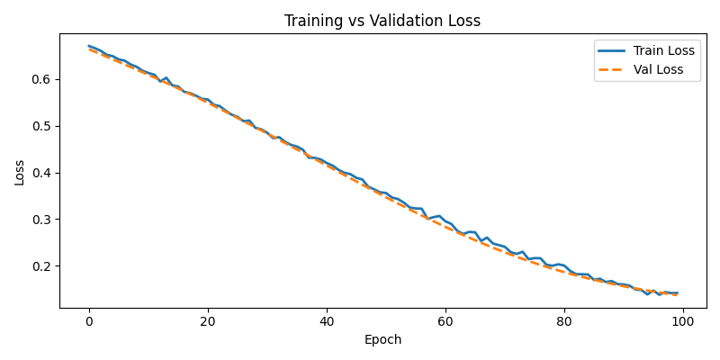

# Breast Cancer Classification with Neural Network (PyTorch)

This project uses a feedforward neural network built in PyTorch to classify breast cancer tumors as malignant or benign. It demonstrates data preprocessing, model training, and binary classification evaluation as part of an AI/ML portfolio.

## Overview

This project implements a neural network in PyTorch to perform binary classification on the Breast Cancer Wisconsin dataset from scikit-learn. The goal is to predict whether a tumor is malignant or benign based on diagnostic features.

The project demonstrates the core steps of a machine learning pipeline:

- loading and preprocessing structured medical data
- splitting the dataset into training and test sets
- building and training a neural network
- evaluating model performance on unseen data
---

## Model Architecture

A simple feedforward neural network (Multi-Layer Perceptron) with the following structure:

Input Layer (30 features)
        ↓
Hidden Layer (32 neurons, ReLU)
        ↓
Hidden Layer (16 neurons, ReLU)
        ↓
Output Layer (1 neuron, raw logits)

| Layer  | Type            | Size           | Activation |
|-------:|-----------------|----------------|------------|
| 1      | Fully Connected | input_dim → 32 | ReLU       |
| 2      | Fully Connected | 32 → 16        | ReLU       |
| Output | Fully Connected | 16 → 1         | Linear (logits) |

The model outputs raw logits which are interpreted using a threshold during evaluation. The `BCEWithLogitsLoss` function internally applies a sigmoid transformation in a numerically stable way.

---

## Training Details

- **Loss Function:** Binary Cross Entropy with Logits (`BCEWithLogitsLoss`)
- **Optimizer:** Adam (learning rate = 0.001)
- **Epochs:** 100
- **Batching:** Full-batch training (for simplicity)
- **Metrics:** Training accuracy, validation accuracy, precision, recall, and F1-score

The training loop includes:
- Forward pass
- Loss computation
- Backpropagation (`loss.backward()`)
- Weight updates (`optimizer.step()`)

---

## Results

After 100 epochs of training, the model typically achieves:

- **90–97% accuracy on the test set**

Exact results may vary slightly due to randomness in data splitting and weight initialization.

---

## Model Comparison

To better understand model performance, several baseline models were evaluated on the same dataset.

| Model | Test Accuracy |
|------|---------------|
| Logistic Regression | ~95–96% |
| Random Forest | ~96–97% |
| Neural Network (PyTorch) | **94.74%** |

While the neural network performs competitively, simpler models such as Random Forest and Logistic Regression can achieve similar or slightly higher accuracy on structured tabular datasets like this one.

This comparison highlights the importance of evaluating multiple models when solving machine learning problems.


## Model Evaluation

After training for 100 epochs, the model achieved the following performance on the held-out test set:

- **Test Accuracy:** 94.74%
- **Weighted F1 Score:** 0.95
- **Macro Average F1 Score:** 0.94

These results demonstrate that the neural network generalizes well to unseen data while maintaining balanced precision and recall across both classes.

### Confusion Matrix

```text
[[39  3]
 [ 3 69]]

              precision    recall  f1-score   support

malignant       0.93      0.93      0.93        42
benign          0.96      0.96      0.96        72

accuracy                            0.95       114
macro avg       0.94      0.94      0.94       114
weighted avg    0.95      0.95      0.95       114
```

---
## Training Curve

The plot below shows training and validation loss over time.




## Project Structure

```text
breast_cancer_nn/
│
├── breast_cancer_nn.py      # Main training and evaluation script
├── requirements.txt         # Project dependencies
└── README.md                # Project documentation
```

## Installation

Clone the repository:

```bash
git clone https://github.com/Splodz/ai-ml-portfolio.git
cd ai-ml-portfolio/breast-cancer-classification
```

## Install dependencies:

```bash
pip install -r requirements.txt
```

Run the model:

```bash
python breast_cancer_nn.py
```
