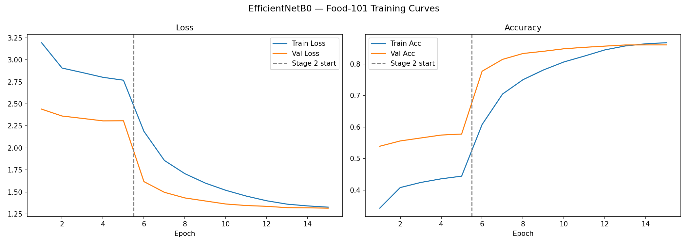
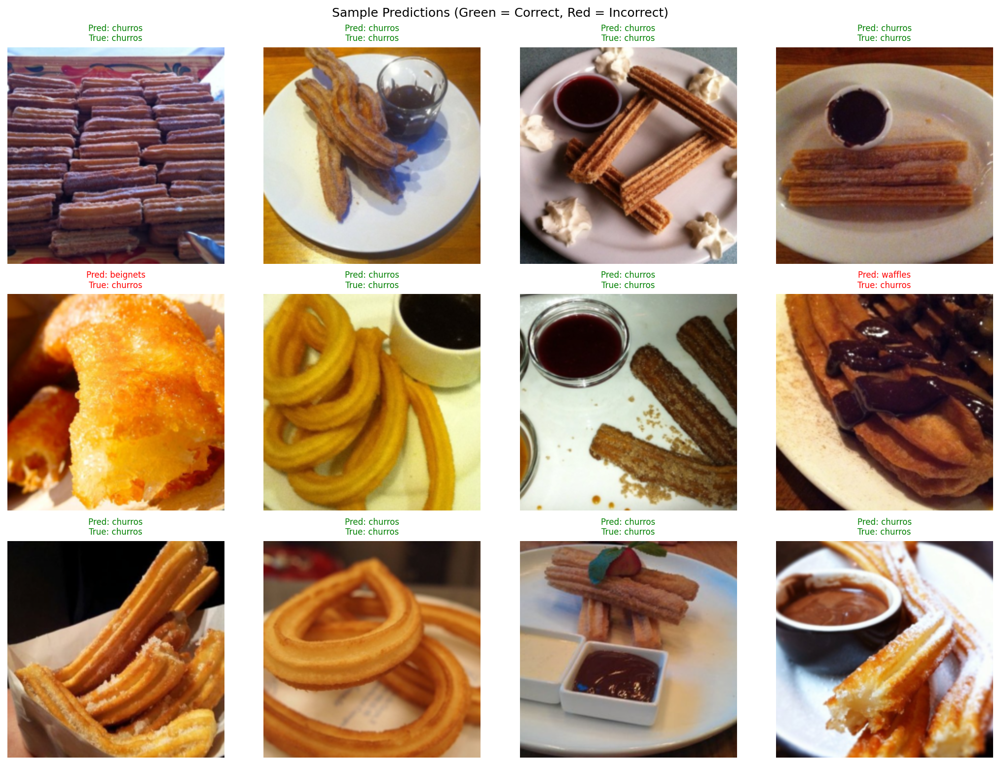

# Food-101 Image Classification — EfficientNetB0 Transfer Learning

This project fine-tunes **EfficientNetB0** on the Food-101 dataset for 101-class food image classification. It demonstrates a complete computer vision pipeline including data augmentation, two-stage transfer learning, and top-1/top-5 evaluation — the standard approach for image classification in industry.

---

## 📌 Problem Statement

Given a photo of food, classify it into one of **101 categories** — from apple pie to waffles.

- **Dataset:** Food-101 — 101,000 real-world food images
- **Task:** 101-class image classification
- **Challenge:** High intra-class variation (the same dish can look very different) and inter-class similarity (many dishes share visual features)

---

## 🧠 Key Concepts Demonstrated

- Transfer learning with a pretrained convolutional neural network
- Two-stage fine-tuning: feature extraction → full fine-tuning
- Data augmentation for improved generalization
- ImageNet normalization for pretrained models
- Label smoothing regularization
- Cosine annealing learning rate schedule
- Best model checkpointing
- Top-1 and Top-5 accuracy evaluation
- Sample prediction visualization

---

## 🔧 Pipeline Overview

```
Food-101 Dataset (101,000 images, 101 classes)
        ↓
Data Augmentation (train) / Normalization (train + val)
RandomResizedCrop · RandomHorizontalFlip · ColorJitter · RandomRotation
        ↓
EfficientNetB0 Backbone (pretrained on ImageNet)
        ↓
Custom Classification Head
Dropout(0.4) → Linear(1280 → 101)
        ↓
Stage 1 — Feature Extraction (5 epochs, lr=1e-3)
Backbone frozen → train head only
        ↓
Stage 2 — Full Fine-Tuning (10 epochs, lr=1e-4)
All layers unfrozen → train end-to-end
        ↓
Evaluation (Top-1 Accuracy, Top-5 Accuracy)
        ↓
Training Curves + Sample Predictions
```

---

## 🗂️ Dataset

- **Source:** [Food-101](https://data.vision.ee.ethz.ch/cvl/datasets_extra/food-101/) via torchvision
- **Size:** 101,000 images across 101 food categories
- **Split:** 750 training images per class (75,750 total) / 250 test images per class (25,250 total)
- **Image size:** Resized and cropped to 224×224 (EfficientNetB0 default)
- **Download:** ~5GB, handled automatically by torchvision on first run

---

## 🖼️ Data Augmentation

Augmentation is applied only to the training set. The validation set uses a deterministic resize and center crop to ensure consistent evaluation.

| Transform | Value | Rationale |
|-----------|-------|-----------|
| `RandomResizedCrop` | 224px, scale (0.7–1.0) | Simulates different distances and framings |
| `RandomHorizontalFlip` | p=0.5 | Food images are horizontally symmetric |
| `ColorJitter` | brightness/contrast/saturation ±0.3 | Simulates lighting variation |
| `RandomRotation` | ±15° | Handles dishes photographed at an angle |
| `Normalize` | ImageNet mean/std | Required for pretrained backbone |

---

## 🤖 Model: EfficientNetB0

EfficientNet scales model depth, width, and resolution jointly using a compound coefficient — achieving better accuracy per parameter than ResNet architectures. EfficientNetB0 is the smallest and fastest variant, making it ideal for fine-tuning on a single GPU.

| Property | Value |
|----------|-------|
| Backbone | EfficientNetB0 (ImageNet pretrained) |
| Backbone output | 1,280-dimensional feature vector |
| Classification head | Dropout(0.4) → Linear(1280, 101) |
| Total parameters | ~5.3M |
| Pretrained on | ImageNet-1K (1.2M images, 1,000 classes) |

The original ImageNet head (Linear(1280, 1000)) is replaced with a task-specific head for 101 food classes.

---

## ⚙️ Two-Stage Training Strategy

Training in two stages is the industry best practice for transfer learning. It prevents the randomly initialized classification head from corrupting the pretrained backbone weights during early training.

### Stage 1 — Feature Extraction

| Parameter | Value |
|-----------|-------|
| Backbone | Frozen |
| Trainable params | ~50k (head only) |
| Epochs | 5 |
| Learning rate | 1e-3 |
| Optimizer | Adam |
| LR schedule | Cosine annealing |
| Loss | CrossEntropy + label smoothing (0.1) |

### Stage 2 — Full Fine-Tuning

| Parameter | Value |
|-----------|-------|
| Backbone | Unfrozen |
| Trainable params | ~5.3M (entire network) |
| Epochs | 10 |
| Learning rate | 1e-4 |
| Optimizer | Adam + weight decay (1e-4) |
| LR schedule | Cosine annealing |
| Loss | CrossEntropy + label smoothing (0.1) |
| Checkpointing | Best val accuracy saved and restored |

---

## 📊 Results

| Metric | Score |
|--------|-------|
| Top-1 Accuracy | — |
| Top-5 Accuracy | — |

> Results to be filled in after running `food_classifier.py`

### Training Curves



The dashed vertical line marks the transition from Stage 1 to Stage 2.

---

## 🍽️ Sample Predictions



Green = correct prediction · Red = incorrect prediction

---

## 📂 Project Structure

```text
food-classification/
│
├── food_classifier.py                      # Main training and evaluation script
├── food_classifier_with_interview_notes.py # Annotated version with design rationale
├── training_curves.png                     # Loss and accuracy curves
├── sample_predictions.png                  # Sample predictions grid
├── requirements.txt                        # Project dependencies
└── README.md                               # Project documentation
```

---

## ⚙️ Installation

```bash
git clone https://github.com/Splodz/ai-ml-portfolio.git
cd ai-ml-portfolio/food-classification
pip install -r requirements.txt
python food_classifier.py
```

> A CUDA-capable GPU is strongly recommended. The Food-101 dataset (~5GB) will download automatically on first run.

---

## 📦 Requirements

```text
torch
torchvision
numpy
matplotlib
```

---

## 👤 Author

Graduate student in Artificial Intelligence with a focus on machine learning and deep learning systems.
